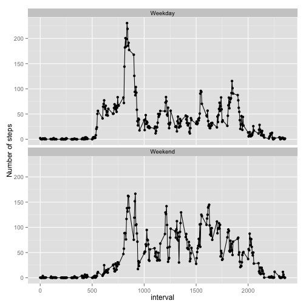

#Reproducible research report on Activity Monitoring Data
===========================================================

##Loading required libraries and reading in the data
Loading three libraries:
- plyr
- dplyr
- ggplot2
for table manipulation and graphing tools.


```r
require("plyr")
require("dplyr")
require("ggplot2")
library(plyr)
library(dplyr)
library(ggplot2)
```

Reading in the data and storing it in a new variable, fulldata, in order to preserve the original source.
Then, converting the Date column to POSIXct so that the plotting tools will work.

```r
rawdata <- read.csv("activity.csv")
fulldata <- rawdata
fulldata$date <- as.POSIXct(fulldata$date)
```

##What is the mean total number of steps taken per day?
Calculate the total number of steps per day and display in a histogram:

```r
statsfunc <- function(fulldata){
  return(data.frame(
    Sumsteps = sum(fulldata$steps, na.rm = TRUE)))
}
sumstats <- ddply(fulldata, .(date), statsfunc)


qplot(date, Sumsteps, data=sumstats, geom="histogram", stat="identity")
```

 

The mean number of steps per day:

```r
mean(sumstats$Sumsteps)
```

```
## [1] 9354.23
```

The median number of steps per day:

```r
median(sumstats$Sumsteps)
```

```
## [1] 10395
```

##What is the average daily activity pattern?
Calculating the mean by a factor of Interval. The mean for each interval group is returned as meanIntervalSteps:

```r
meantimefunc <- function(fulldata){
  return(data.frame(
    meanIntervalSteps = mean(fulldata$steps, na.rm=TRUE)
  ))
}

meantime <- ddply(fulldata, .(interval), meantimefunc)
```

Plotting as a time series plot:

```r
plot(meantime$interval, meantime$meanIntervalSteps, type = "l")
```

 

The 5 minute interval with the maximum number of steps will be the mean times sorted in order of decreasing values:

```r
head(meantime[order(meantime$meanIntervalSteps, decreasing = TRUE),],1)
```

```
##     interval meanIntervalSteps
## 104      835          206.1698
```

##Imputing missing values
The number of missing cases:

```r
sum(complete.cases(fulldata)==FALSE)
```

```
## [1] 2304
```

Filling in the missing values:

For every row:
-  check if it is a complete case
- if it is not a complete case, record the mean time of that interval, calculated across the complete cases.

```r
imputedData <- data.frame()

for (i in 1:nrow(fulldata)){
  if (complete.cases(fulldata[i,1]) == FALSE){
    
    xx <- function(yy){
     zz <- filter(meantime, interval==yy) ##selecting the interval from the table of mean values
     zz[1,2]
    }
    
    
    imputedData[i,1] = xx(fulldata[i,3])
  }
  
  else{
    imputedData[i,1] = fulldata[i,1]
  }
}
```

Copy the rest of the data set across, then feed in the new values.

```r
completeData <- fulldata
completeData[,1] <- imputedData
```

Sum up the steps taken per day, and create a histogram of the results:

```r
statsfunc <- function(completeData){
  return(data.frame(
    Sumsteps = sum(completeData$steps)))
}
CompleteSteps <- ddply(completeData, .(date), statsfunc)


qplot(date, Sumsteps, data=CompleteSteps, geom="histogram", stat="identity")
```

 

Mean total number of steps per day:

```r
mean(CompleteSteps$Sumsteps)
```

```
## [1] 10766.19
```

Median total number of steps per day:

```r
median(CompleteSteps$Sumsteps)
```

```
## [1] 10766.19
```

These values are different from the previously calculated value. The mean number of steps head increased. The median has also increased and is now the same as the mean. This is likely to be because mean interval values were used to populate the missing values.

##Are there differences in activity patterns between weekdays and weekends?
Add a new factor variable indicating whether the entry is a weekday or a weekend

```r
completeData$day <- weekdays(completeData$date)
completeData$week <- ifelse(completeData$day == "Saturday" | completeData$day == "Sunday","Weekend", "Weekday")
```

Average the number of steps for Weekdays and Weekend, and display in a panel plot:

```r
weekday <- filter(completeData, week=="Weekday")
weekend <- filter(completeData, week=="Weekend")

weekdayfunc <- function(weekday){
  return(data.frame(
    meansteps = mean(weekday$steps, na.rm = TRUE)))
}

weekendfunc <- function(weekend){
  return(data.frame(
    meansteps = mean(weekend$steps, na.rm = TRUE)))
}

weekdaystats <- ddply(weekday, .(interval, week), weekdayfunc)
weekendstats <- ddply(weekend, .(interval, week), weekendfunc)
weekstats <- rbind(weekdaystats, weekendstats)
weekstats$week <- as.factor(weekstats$week)

qplot(interval, meansteps, data=weekstats) + geom_line() + ylab("Number of steps") + facet_wrap(~ week, ncol=1)
```

 
